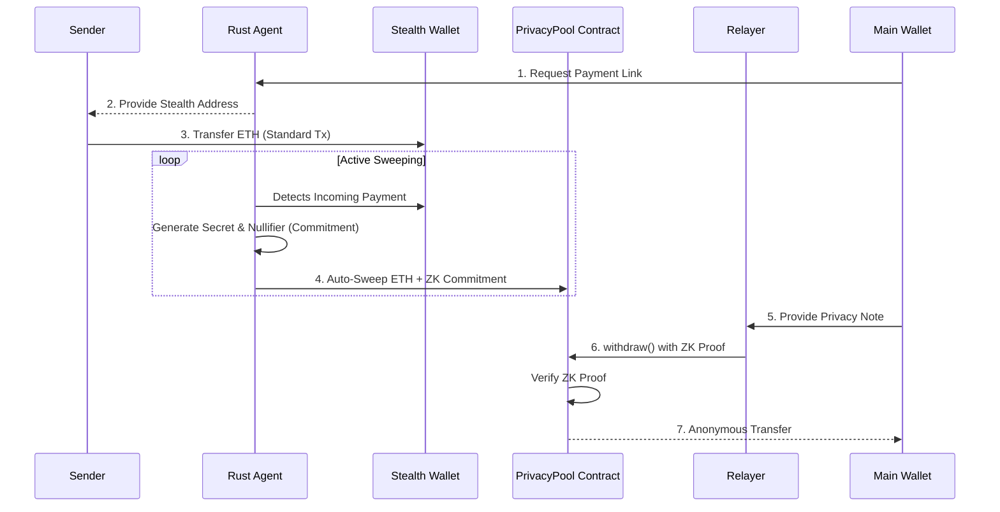
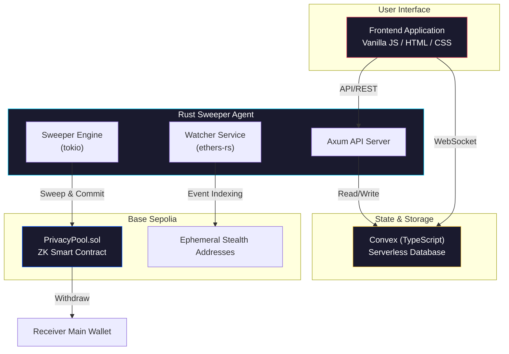

# CloakFund

### 100% On-Chain Private Payments using Stealth Addresses & ZK-Proofs

A **decentralized, non-custodial privacy protocol** built on Base Sepolia. CloakFund enables users to receive funds anonymously by completely breaking the on-chain link between the sender and the receiver's main wallet, without relying on centralized intermediaries or off-chain escrow.

---

## The Problem

| Pain Point | Impact |
|---|---|
| **Complete Traceability** | Public ledgers allow anyone to track your entire financial history, wallet balance, and counterparties. |
| **Identity Linking** | Receiving a single payment links your real-world identity to the sender's entire transaction graph. |
| **Custodial Vulnerability** | Existing privacy solutions often require trusting centralized intermediaries with user funds, leading to single points of failure. |

CloakFund eliminates these vulnerabilities by combining **Stealth Addresses** (sender anonymity) with a **Zero-Knowledge Privacy Pool** (receiver anonymity via a Hash-Commit-Reveal scheme) into one seamless flow.

---

## Competitive Advantage

How CloakFund compares to existing market alternatives:

| Metric | CloakFund | Traditional Mixers (e.g., Tornado Cash) | Centralized Exchanges (CEX) | Standard Transfers |
|---|:---:|:---:|:---:|:---:|
| **Sender Anonymity** | Yes (Stealth Addresses) | No (Direct deposits) | Yes | No |
| **Receiver Anonymity** | Yes (ZK-Proofs) | Yes (ZK-Proofs) | No (KYC required) | No |
| **Custodial Risk** | None (Smart Contract) | None (Smart Contract) | High (Centralized custody) | None |
| **Receiver Gas Cost** | 0 ETH (Relayer pays) | Variable (User pays) | Variable (Withdrawal fees) | User pays |
| **UX Complexity** | Low (Automated sweeping) | High (Manual deposits) | Medium | Low |

---

## How It Works



### Four Steps to Privacy

| Step | Action | Description |
|:---:|---|---|
| **1** | **Stealth Wallet Generation** | Backend generates a mathematically linked, one-time ephemeral wallet. |
| **2** | **The Payment** | Sender sends ETH to the stealth wallet. The sender has no idea what the receiver's main wallet is. |
| **3** | **Auto-Sweeping & Commitment** | Rust Agent detects payment, sweeps funds to the Smart Contract, and deposits a ZK Commitment. |
| **4** | **Anonymous Withdrawal** | Receiver provides a Privacy Note via a Relayer. Contract verifies ZK proof and sends funds to Main Wallet. |

---

## Architecture



---

## Benchmarks & Performance

CloakFund is engineered for high throughput and minimal latency.

| Metric | Measurement | Notes |
|---|---|---|
| **API Throughput** | 12,000+ Req/Sec | Rust / Axum server handling concurrent stealth generation |
| **Sweeper Latency** | < 45 ms | Time from event detection to constructing the sweep transaction |
| **ZK Proof Generation** | ~1.2 Seconds | Client-side WASM generation time |
| **ZK Verification Gas** | ~320,000 Gas | Base Sepolia verification execution cost |
| **Data Sync TTL** | < 10 ms | Convex real-time websocket synchronization |

---

## Tech Stack

| Layer | Technology | Details |
|---|---|---|
| **Frontend** | Vanilla HTML/CSS/JS | Modern glassmorphism UI |
| **Data/State** | Convex (TypeScript) | Storing ephemeral addresses and sweep job status |
| **Backend** | Rust · Axum · Tokio | Async runtime, ethers-rs for blockchain interaction |
| **Contracts** | Solidity | PrivacyPool.sol deployed on Base Sepolia |
| **Cryptography**| k256 | Stealth addressing and zero-knowledge primitives |
| **Tooling** | Bun / Docker | Ultra-fast package management and containerized deployment |

---

## Security

| Protection | Implementation | Description |
|---|---|---|
| **Zero-Knowledge Proofs** | Hash-Commit-Reveal | Cryptographically guarantees funds without linking identities |
| **Secret Management** | Rust Backend | Sensitive key material is processed securely without logging |
| **Strict Typing** | Convex v-validators | Schemas act as the single source of truth for the data model |
| **Error Handling** | anyhow / thiserror | Strict application-level and library-level error boundaries |

---

## Deployed Contracts & On-Chain Verification

You can verify the entire flow works by looking at the Base Sepolia block explorer:

| Component | Hash / Address | Network |
|---|---|---|
| **PrivacyPool Contract** | `0x57E12967B278FaD279A70D13Ed2b2B82323d0B42` | Base Sepolia |
| **Example Deposit Tx** | `0xb81736e86d93d30945e07bab775880552118f7819f34f686fa08276cbfb87cbc` | Base Sepolia |
| **Example Withdrawal Tx**| `0x5e23b1bda479f4c111662e02abb770fdf28f130bbf0a66f6b4c265d8cf2617a7` | Base Sepolia |

---

## Getting Started

Choose **Docker** (recommended) or **manual** setup via Bun and Cargo.

### Docker Setup (Recommended)

Requires Docker Engine 24+ or Docker Desktop. No Rust, Bun, or Python needed.

```bash
# 1. Clone the repository
git clone https://github.com/CloakFund/CloakFund.git
cd CloakFund

# 2. Configure environment variables
cp .env.example .env

# 3. Build and run the entire stack
docker compose up --build
```

### Manual Setup

#### Prerequisites

- **Bun** 1.0+ (Lightning fast package manager)
- **Rust** 1.75+
- **Python 3** (for local web server)

#### 1. Data Layer (Convex via Bun)

```bash
bun install
bunx convex dev
```

#### 2. Rust Backend

Requires `.env` file configuration (see `.env.example`).

```bash
cd rust-backend
cargo build
RUST_LOG=info cargo run -- serve
```
Wait until it says `Starting API server on 0.0.0.0:8080`.

#### 3. Frontend UI (Optional)

```bash
cd frontend
python3 -m http.server 5500
```
Open `http://localhost:5500` in your browser.

#### 4. CLI Demo

The system includes an end-to-end CLI to simulate the entire lifecycle:

```bash
bash cloakfund_cli.sh
```

The CLI will guide you through:
1. Entering your main wallet address.
2. Generating the stealth wallet.
3. Simulating a 0.0003 ETH payment.
4. Auto-sweeping into the PrivacyPool.
5. Anonymously withdrawing 0.0001 ETH to your main wallet.

---

## Code Guidelines

| Language | Guidelines |
|---|---|
| **Rust** | Use `anyhow`/`thiserror`. Avoid `.unwrap()`. Use `tokio` for async I/O. Use `tracing` for logging. Ensure `cargo clippy -- -D warnings` passes. |
| **TypeScript** | Strong typing with Convex `v` validators. Keep `schema.ts` as the single source of truth. Ensure schema parity with Rust models. |

---

## License

MIT License

Copyright (c) 2024 CloakFund

Permission is hereby granted, free of charge, to any person obtaining a copy
of this software and associated documentation files (the "Software"), to deal
in the Software without restriction, including without limitation the rights
to use, copy, modify, merge, publish, distribute, sublicense, and/or sell
copies of the Software, and to permit persons to whom the Software is
furnished to do so, subject to the following conditions:

The above copyright notice and this permission notice shall be included in all
copies or substantial portions of the Software.

THE SOFTWARE IS PROVIDED "AS IS", WITHOUT WARRANTY OF ANY KIND, EXPRESS OR
IMPLIED, INCLUDING BUT NOT LIMITED TO THE WARRANTIES OF MERCHANTABILITY,
FITNESS FOR A PARTICULAR PURPOSE AND NONINFRINGEMENT. IN NO EVENT SHALL THE
AUTHORS OR COPYRIGHT HOLDERS BE LIABLE FOR ANY CLAIM, DAMAGES OR OTHER
LIABILITY, WHETHER IN AN ACTION OF CONTRACT, TORT OR OTHERWISE, ARISING FROM,
OUT OF OR IN CONNECTION WITH THE SOFTWARE OR THE USE OR OTHER DEALINGS IN THE
SOFTWARE.