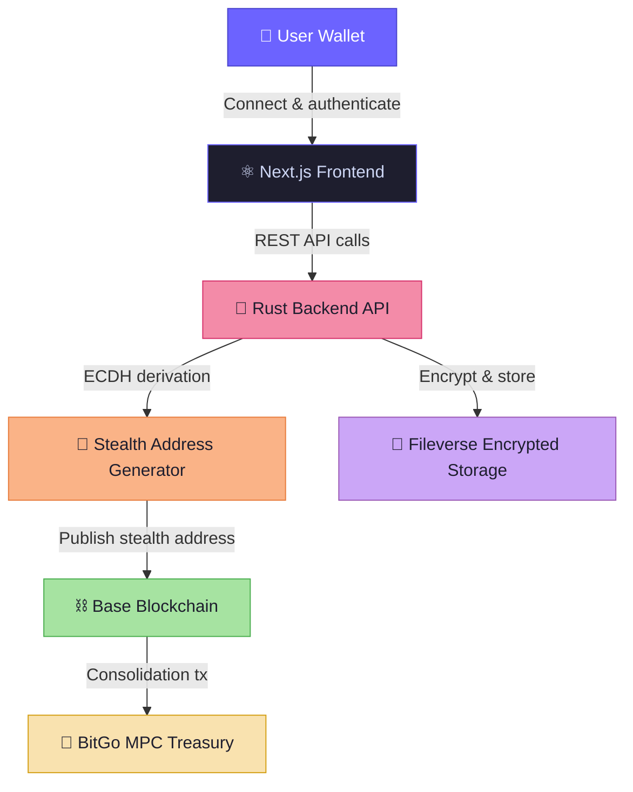

# 🏗️ Architecture

> CloakFund is composed of five major architectural layers working in a unidirectional pipeline.

---

## System Overview

---

## Layer Breakdown

### 1. 🖥️ Frontend — Next.js (TypeScript)

The user-facing application, built with Next.js and TypeScript.

| Responsibility | Description |
| -------------- | ----------- |
| Wallet connection | Connect MetaMask or WalletConnect-compatible wallets |
| ENS identity input | Resolve human-readable names for payment requests |
| Payment link generation | Request stealth addresses from backend and display QR/link |
| Dashboard balance view | Aggregate confirmed deposits across all stealth addresses |
| Receipt decryption | Fetch encrypted receipts and decrypt client-side — server never sees plaintext |

---

### 2. 🦀 Backend — Rust (Axum + Tokio)

The core engine, implemented entirely in Rust for memory safety, cryptographic reliability, and concurrency performance.

| Module | Responsibility |
| ------ | -------------- |
| **API Server** | Handles all frontend REST requests (Axum framework) |
| **Stealth Generator** | ECDH-based one-time address derivation with ephemeral key management |
| **Watcher Service** | Monitors Base blockchain events using ethers-rs for deposit detection |
| **Treasury Engine** | Constructs consolidation transactions for BitGo MPC vault |
| **Encryption Service** | Encrypts receipts (ChaCha20-Poly1305 / AES-GCM) before Fileverse upload |

---

### 3. ⛓️ Blockchain — Base (L2)

On-chain infrastructure deployed on the Base network for low gas fees and fast finality.

| Contract | Purpose |
| -------- | ------- |
| `PaymentResolver` | Resolves ENS identity to payment metadata |
| `TreasuryForwarder` | Forwards stealth deposits to the BitGo treasury vault |

> Most logic runs **off-chain** in Rust — contracts are intentionally minimal.

---

### 4. 🏦 Treasury — BitGo MPC

Secure fund consolidation using BitGo's multi-party computation infrastructure.

| Feature | Benefit |
| ------- | ------- |
| MPC wallets | No single point of key compromise |
| Multi-signature approvals | Funds cannot move without threshold agreement |
| Custody API | Programmatic consolidation from stealth addresses |

---

### 5. 📄 Encrypted Storage — Fileverse

Persistent, encrypted storage for payment receipts and financial records.

| Feature | Benefit |
| ------- | ------- |
| Encrypted at rest | All data encrypted before upload |
| Decentralized storage | No single provider controls the data |
| Client-side decryption | Backend never sees plaintext — zero-knowledge design |

---

→ See [DATA_FLOW.md](./DATA_FLOW.md) for full data flow diagrams.
→ See [RUST_BACKEND_DESIGN.md](./RUST_BACKEND_DESIGN.md) for backend internals.
