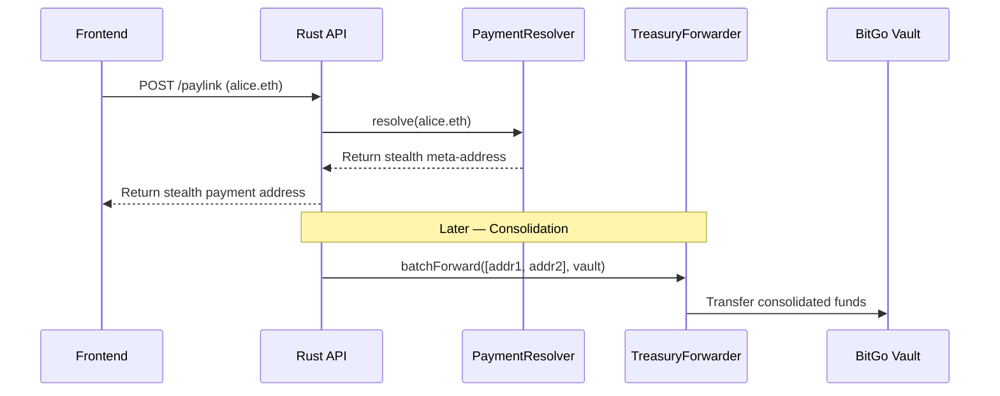

# 📜 Smart Contracts

> Smart contracts are **intentionally minimal**. Most logic runs off-chain in Rust — contracts handle only what must live on-chain.

---

## Design Philosophy

| Principle | Rationale |
| --------- | --------- |
| **Minimal on-chain logic** | Reduces gas costs and attack surface |
| **Off-chain computation** | Stealth address generation and encryption happen in Rust |
| **On-chain settlement only** | Contracts handle fund routing and identity resolution |

---

## Contract: `PaymentResolver`

Resolves an ENS identity to the payment metadata needed for stealth address generation.

```
┌──────────────────────────────────────┐
│         PaymentResolver.sol          │
├──────────────────────────────────────┤
│  resolve(ensNode) → paymentMeta     │
│  updateMeta(ensNode, newMeta)        │
│  getStealthPub(ensNode) → pubKey    │
└──────────────────────────────────────┘
```

| Function | Description |
| -------- | ----------- |
| `resolve()` | Returns stealth meta-address for a given ENS identity |
| `updateMeta()` | Owner updates their stealth public key (one-time setup) |
| `getStealthPub()` | Returns the recipient's stealth meta-address public key |

---

## Contract: `TreasuryForwarder`

Forwards funds from stealth deposit addresses to the BitGo MPC treasury vault.

```
┌──────────────────────────────────────┐
│        TreasuryForwarder.sol         │
├──────────────────────────────────────┤
│  forward(stealthAddr, vault)        │
│  batchForward(addrs[], vault)       │
│  setVault(newVault) [onlyOwner]     │
└──────────────────────────────────────┘
```

| Function | Description |
| -------- | ----------- |
| `forward()` | Moves funds from a single stealth address to the treasury vault |
| `batchForward()` | Consolidates multiple stealth addresses in a single transaction |
| `setVault()` | Admin function to update the treasury vault address |

---

## Deployment

| Parameter | Value |
| --------- | ----- |
| **Network** | Base (L2) |
| **Gas optimization** | Minimal storage, no loops over unbounded arrays |
| **Access control** | `onlyOwner` for admin functions |
| **Upgradeability** | Not upgradeable — immutable deployment for trust |

---

## Interaction Flow



---

→ See [CRYPTOGRAPHY.md](./CRYPTOGRAPHY.md) for how stealth addresses are derived.
→ See [SECURITY.md](./SECURITY.md) for contract security considerations.
