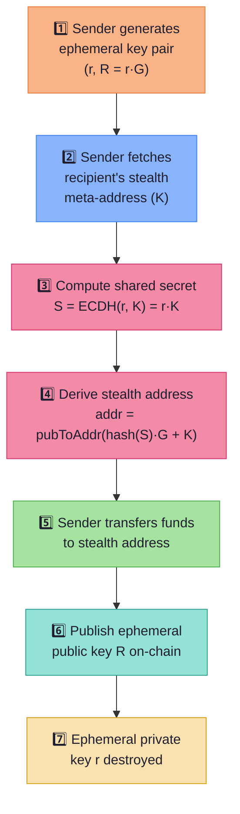

# 🔐 Cryptography

> CloakFund uses **elliptic curve cryptography** to generate stealth addresses, ensuring each payment uses a unique, unlinkable address.

---

## Stealth Address Generation

The core privacy mechanism uses **ECDH (Elliptic Curve Diffie-Hellman)** to derive one-time payment addresses without requiring the sender and recipient to communicate directly.

### Step-by-Step Process



| Step | Operation | Input | Output |
| ---- | --------- | ----- | ------ |
| 1 | Generate ephemeral key pair | Random seed | `(r, R)` where `R = r·G` |
| 2 | Fetch recipient meta-address | ENS name | Stealth public key `K` |
| 3 | Compute shared secret | `r`, `K` | `S = r·K` (ECDH) |
| 4 | Derive stealth address | `S`, `K` | `addr = pubToAddr(hash(S)·G + K)` |
| 5 | Transfer funds | ETH amount | Transaction to stealth address |
| 6 | Publish ephemeral key | `R` | Stored on-chain or via API |
| 7 | Destroy ephemeral key | `r` | Zeroized from memory |

### Recipient Recovery

The recipient can recover funds by:

1. Scanning published ephemeral keys `R`
2. Computing `S = k·R` (where `k` is recipient's private key)
3. Deriving the stealth private key: `stealthKey = hash(S) + k`
4. Checking if the derived address matches any on-chain deposits

> **This ensures only the intended recipient can discover and access their payments.**

---

## Receipt Encryption

Payment receipts are encrypted using **authenticated symmetric encryption** before storage on Fileverse.

| Algorithm | Type | Use Case |
| --------- | ---- | -------- |
| **ChaCha20-Poly1305** | AEAD (primary) | High-performance encryption with authentication |
| **AES-GCM** | AEAD (fallback) | Alternative for hardware-accelerated environments |

### Encryption Flow

```
Receipt Plaintext
       │
       ▼
┌──────────────┐     ┌──────────────┐
│ Generate     │────▶│ Encrypt with │────▶ Ciphertext + Auth Tag
│ nonce (12B)  │     │ ChaCha20-P.  │
└──────────────┘     └──────────────┘
                           │
                           ▼
                    Upload to Fileverse
                           │
                           ▼
                  Frontend downloads ciphertext
                           │
                           ▼
                  Decrypt client-side with user key
```

---

## Key Principles

| Principle | Implementation |
| --------- | -------------- |
| 🚫 **No private keys stored server-side** | Backend never holds recipient private keys |
| 🔥 **Ephemeral keys destroyed after use** | `zeroize` crate ensures secure memory clearing |
| 🔒 **All encryption performed locally** | Receipt decryption happens in the browser, not the server |
| 🎲 **Each address is unique** | Fresh ephemeral key per payment = unique shared secret = unique address |
| 🔗 **Unlinkable addresses** | Without the recipient's private key, addresses cannot be connected |

---

## Cryptographic Libraries

| Library | Purpose |
| ------- | ------- |
| `k256` | Secp256k1 curve operations (ECDH, key derivation) |
| `hkdf` | Key derivation function for shared secret expansion |
| `sha3` / `keccak` | Ethereum address derivation from public key |
| `chacha20poly1305` | Primary authenticated encryption |
| `aes-gcm` | Fallback authenticated encryption |
| `zeroize` | Secure ephemeral key destruction |

---

→ See [CONTRACTS.md](./CONTRACTS.md) for on-chain stealth address resolution.
→ See [SECURITY.md](./SECURITY.md) for the full security model.
