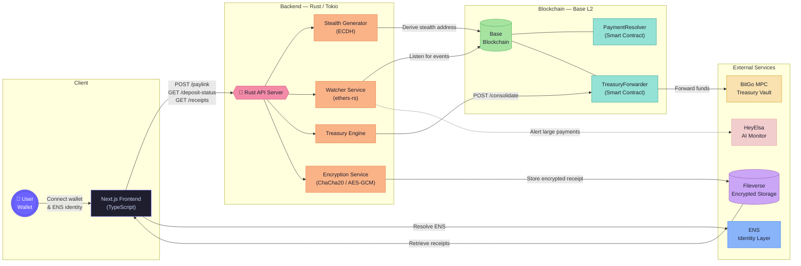
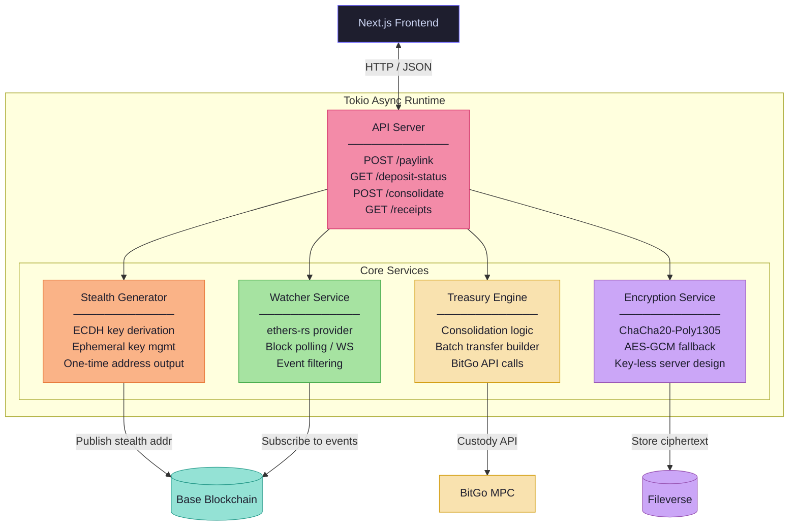
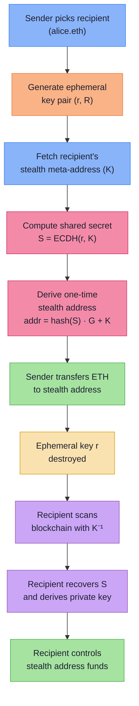

# CloakFund — Data Flow

> Complete data-flow reference for the CloakFund privacy-preserving payment platform.

---

## 1. High-Level System Architecture

Five architectural layers interact in a strictly unidirectional pipeline:

| #   | Layer          | Technology           | Responsibility                                                                |
| --- | -------------- | -------------------- | ----------------------------------------------------------------------------- |
| 1   | **Frontend**   | Next.js / TypeScript | Wallet connection, ENS input, payment links, dashboard, receipt decryption    |
| 2   | **Backend**    | Rust (Tokio async)   | Stealth address generation, watcher, treasury engine, encryption              |
| 3   | **Blockchain** | Base (L2)            | On-chain settlement, smart contracts (`PaymentResolver`, `TreasuryForwarder`) |
| 4   | **Treasury**   | BitGo MPC            | Multi-sig custody, fund consolidation                                         |
| 5   | **Storage**    | Fileverse            | Encrypted receipt & financial record persistence                              |

---

## 2. End-to-End Payment Flow

A complete transaction progresses through **nine sequential steps** (event-driven):

```mermaid
sequenceDiagram
    autonumber

    actor Sender as 👤 Sender
    participant FE as Next.js Frontend
    participant ENS as ENS Registry
    participant API as 🦀 Rust API
    participant SG as Stealth Generator
    participant BC as Base Blockchain
    participant WS as Watcher Service
    participant TE as Treasury Engine
    participant ES as Encryption Service
    participant BG as BitGo MPC Vault
    participant FV as Fileverse Storage
    participant AI as HeyElsa AI

    Sender->>FE: Connect wallet
    FE->>ENS: Resolve recipient ENS name
    ENS-->>FE: Return ENS metadata

    rect rgb(30, 30, 46)
        Note over FE,SG: Step 1-4 — Address Generation
        FE->>API: POST /paylink (ENS identity)
        API->>SG: Request stealth address
        SG->>SG: Generate ephemeral key pair
        SG->>SG: Derive shared secret (ECDH)
        SG->>SG: Compute one-time stealth address
        SG-->>API: Return stealth address
        API-->>FE: Return payment link
    end

    rect rgb(46, 30, 30)
        Note over Sender,BC: Step 5 — Fund Transfer
        FE-->>Sender: Display payment link / QR
        Sender->>BC: Transfer funds to stealth address
    end

    rect rgb(30, 46, 30)
        Note over BC,FV: Step 6-8 — Detection & Storage
        BC--)WS: Emit deposit event
        WS->>API: Notify deposit detected
        API->>API: GET /deposit-status (confirmed)
        API->>ES: Encrypt payment receipt
        ES->>ES: ChaCha20-Poly1305 / AES-GCM
        ES->>FV: Store encrypted receipt
    end

    rect rgb(46, 46, 30)
        Note over TE,BG: Step 9 — Treasury Consolidation
        API->>TE: POST /consolidate
        TE->>BC: Call TreasuryForwarder contract
        BC->>BG: Forward funds to MPC vault
    end

    WS-->>FE: Push dashboard update
    FE-->>Sender: Display updated balance
    WS--)AI: Alert on large payment (optional)
    Sender->>FE: GET /receipts (decrypt locally)
    FE->>FV: Fetch encrypted receipt
    FV-->>FE: Return ciphertext
    FE->>FE: Decrypt receipt client-side
```

---

## 3. Rust Backend — Internal Service Map

All backend modules run as **concurrent Tokio tasks** sharing an async runtime:

---

## 4. Stealth Address Cryptography Flow

The privacy-critical path that ensures **no two payments share an address**:

---

## 5. API Endpoints Summary

| Method | Endpoint          | Description                        | Triggered By                 |
| ------ | ----------------- | ---------------------------------- | ---------------------------- |
| `POST` | `/paylink`        | Generate a stealth payment address | Frontend → Stealth Generator |
| `GET`  | `/deposit-status` | Check payment confirmation status  | Frontend → Watcher Service   |
| `POST` | `/consolidate`    | Move funds to BitGo MPC treasury   | Backend → Treasury Engine    |
| `GET`  | `/receipts`       | Retrieve encrypted receipt list    | Frontend → Fileverse         |

---

## 6. Security Invariants Across the Flow

| Invariant                            | Enforced By                                  |
| ------------------------------------ | -------------------------------------------- |
| No private keys stored server-side   | Rust backend design — stateless key handling |
| Ephemeral keys destroyed after use   | Stealth Generator — in-memory only           |
| All encryption performed client-side | Frontend decrypts receipts locally           |
| Stealth addresses prevent clustering | ECDH-derived one-time addresses              |
| Treasury requires multi-sig approval | BitGo MPC — threshold signatures             |
| Metadata encrypted at rest           | Fileverse — ChaCha20-Poly1305 / AES-GCM      |
