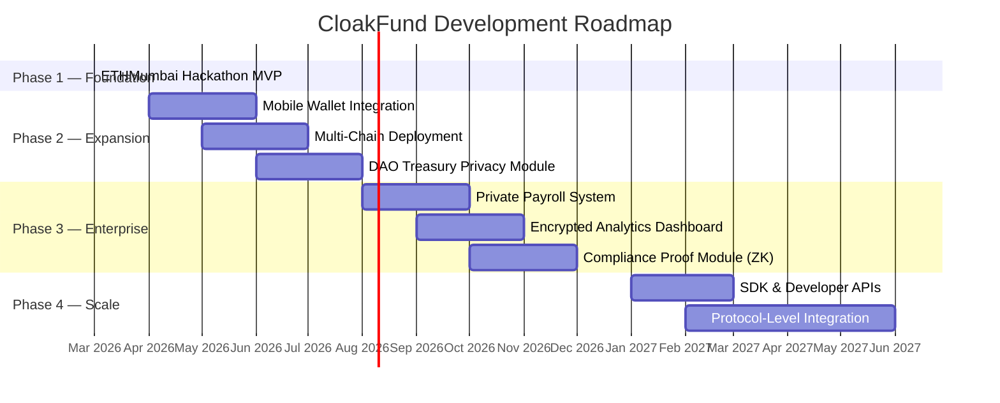

# 🔮 Future Work

> CloakFund is designed as a foundation — here's where it goes next.

---

## Post-Hackathon Roadmap

---

## Planned Features

| Feature | Description | Impact |
| ------- | ----------- | ------ |
| 📱 **Mobile Wallet Integration** | Native mobile app with stealth payment support | Privacy on every device |
| 🏛️ **DAO Treasury Privacy** | Private governance spending with cryptographic audit trails | DAOs can operate without financial surveillance |
| 💼 **Private Payroll Systems** | Pay employees via stealth addresses without public salary disclosure | Real-world enterprise adoption |
| 📊 **Encrypted Analytics Dashboards** | Aggregate payment insights without exposing individual transactions | Business intelligence + privacy |
| 🌐 **Multi-Chain Deployment** | Deploy on Ethereum, Arbitrum, Optimism, Polygon, and more | Broader ecosystem reach |
| 🔍 **ZK Compliance Proofs** | Prove regulatory compliance without revealing transaction details | Privacy + compliance coexistence |
| 🧰 **Developer SDK** | npm/cargo packages for integrating CloakFund stealth payments | Third-party adoption |

---

## Technical Enhancements

| Enhancement | Description |
| ----------- | ----------- |
| **ERC-5564 Compliance** | Full alignment with the stealth address standard |
| **Batch Address Generation** | Generate multiple stealth addresses in a single request |
| **Automated Consolidation Rules** | Configurable auto-sweep triggers (amount threshold, time-based) |
| **Multi-Currency Support** | Stealth payments for ERC-20 tokens, not just native ETH |
| **Offline Recovery** | Paper backup mechanism for stealth meta-address keys |

---

## Long-Term Vision

> **CloakFund becomes the default privacy layer for Web3 finance** — an invisible, composable module that any dApp can integrate to give users financial privacy without changing their workflow.

---

→ See [VISION.md](./VISION.md) for the full mission statement.
