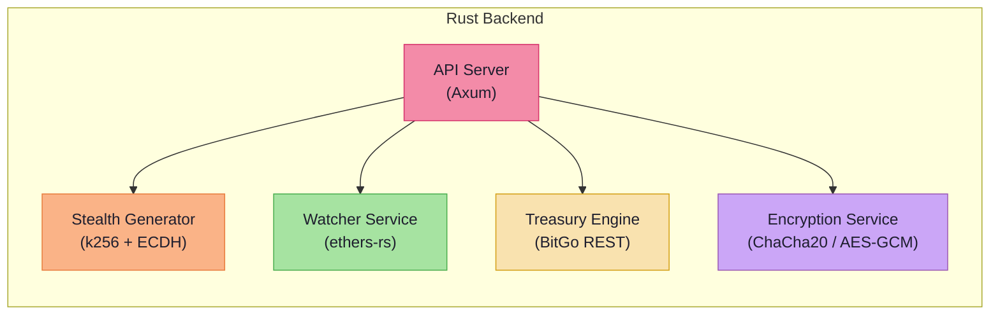

# 🦀 Rust Backend Design

> The entire backend is implemented in **Rust** — chosen for memory safety, cryptographic reliability, and high-concurrency performance.

---

## Why Rust?

| Reason | Benefit for CloakFund |
| ------ | --------------------- |
| 🔒 **Memory safety** | No buffer overflows or use-after-free in cryptographic code |
| 🔐 **Cryptographic reliability** | First-class support via `k256`, `chacha20poly1305`, `aes-gcm` crates |
| ⚡ **Concurrency performance** | Tokio async runtime handles watcher + API concurrently without threads |
| 🛡️ **Zero-cost abstractions** | Production-grade performance without runtime overhead |

---

## Core Modules



### 📡 API Server

- **Framework**: Axum (lightweight, Tokio-native)
- **Responsibility**: Handles all HTTP requests from the Next.js frontend
- **Endpoints**: `POST /paylink`, `GET /deposit-status`, `POST /consolidate`, `GET /receipts`

### 🔐 Stealth Generator

- **Cryptography**: ECDH (Elliptic Curve Diffie-Hellman) using the `k256` crate
- **Process**: Generates ephemeral key pair → derives shared secret → computes one-time stealth address
- **Security**: Ephemeral keys are **zeroized** immediately after use — never persisted

### 👁️ Watcher Service

- **Provider**: ethers-rs with WebSocket subscription to Base blockchain
- **Process**: Listens for `Transfer` events and native ETH receipts targeting generated stealth addresses
- **Resilience**: Reconnect logic with exponential backoff; historical log sync for missed events

### 🏦 Treasury Engine

- **Integration**: BitGo REST API for MPC wallet operations
- **Process**: Constructs consolidation transactions, submits signing requests, tracks job state
- **State Machine**: `pending → signed → broadcasted → confirmed`

### 📄 Encryption Service

- **Algorithms**: ChaCha20-Poly1305 (primary), AES-GCM (fallback)
- **Design**: Server encrypts receipt payload before upload to Fileverse
- **Invariant**: **No private keys stored server-side** — key-less server architecture

---

## CLI Usage (Stealth Module)

The Rust backend currently includes a small CLI for generating stealth payment data (sender side) and recovering the stealth private key (recipient side).

Generate stealth payment data (address + ephemeral pubkey + view tag):

- `cargo run --manifest-path rust-backend/Cargo.toml -- generate <recipient_pubkey_hex>`

Recover stealth private key (recipient side), using the recipient’s private key and the published ephemeral public key:

- `cargo run --manifest-path rust-backend/Cargo.toml -- recover <recipient_priv_hex> <ephemeral_pub_hex>`

Notes:
- Inputs may be provided with or without a `0x` prefix.
- Never paste real mainnet private keys into terminals/logs; use test keys only.

---

## Async Runtime

All services run as **concurrent Tokio tasks** sharing a single async runtime:

```
┌──────────────────────────────────────────┐
│            Tokio Async Runtime           │
│                                          │
│   ┌──────────┐    ┌──────────────────┐   │
│   │ API Task │    │ Watcher Task     │   │
│   │ (Axum)   │    │ (ethers-rs WS)   │   │
│   └──────────┘    └──────────────────┘   │
│                                          │
│   Tasks share: connection pools,         │
│   state, and channel-based messaging     │
└──────────────────────────────────────────┘
```

- The **API Server** and **Watcher Service** run as separate async tasks
- Inter-service communication uses Tokio channels (`mpsc`, `broadcast`)
- Graceful shutdown ensures all in-flight operations complete

---

## Crate Dependencies

| Crate | Purpose |
| ----- | ------- |
| `axum` | HTTP framework |
| `tokio` | Async runtime |
| `ethers-rs` | Ethereum provider and contract bindings |
| `k256` | Secp256k1 elliptic curve operations |
| `chacha20poly1305` | Authenticated encryption |
| `aes-gcm` | Alternative authenticated encryption |
| `zeroize` | Secure memory clearing for ephemeral keys |
| `serde` / `serde_json` | Serialization |
| `sqlx` | Async database driver |

---

→ See [API.md](./API.md) for endpoint specifications.
→ See [CRYPTOGRAPHY.md](./CRYPTOGRAPHY.md) for the stealth address math.
