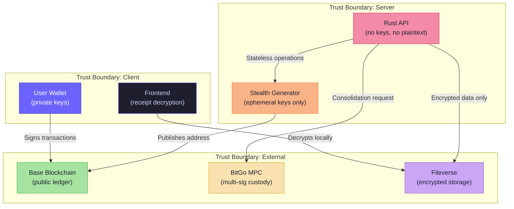

# 🛡️ Security

> CloakFund prioritizes **privacy and financial safety** at every layer of the architecture.

---

## Security Model Overview

---

## Security Invariants

| # | Invariant | Enforced By | Verification |
| - | --------- | ----------- | ------------ |
| 1 | **Private keys never leave user's wallet** | Frontend design — all signing via wallet provider | Code review, no key input fields |
| 2 | **Backend never stores private keys** | Rust architecture — stateless key handling | No key storage in DB schema |
| 3 | **Ephemeral keys destroyed after use** | `zeroize` crate — secure memory clearing | Unit tests verify zeroization |
| 4 | **Receipts encrypted before server storage** | Encryption Service — ChaCha20/AES-GCM | Ciphertext-only in Fileverse |
| 5 | **Decryption happens client-side only** | Frontend-only decrypt — server never sees plaintext | No decrypt endpoints in API |
| 6 | **Stealth addresses prevent clustering** | ECDH one-time addresses — unique per payment | Cryptographic guarantee |
| 7 | **Treasury requires multi-sig approval** | BitGo MPC — threshold signatures | BitGo audit trail |

---

## Key Protection

| Key Type | Location | Protection |
| -------- | -------- | ---------- |
| User private key | User's wallet (MetaMask, etc.) | Never transmitted to CloakFund |
| Ephemeral key (`r`) | Server memory (transient) | Zeroized immediately after stealth address derivation |
| Receipt encryption key | Derived client-side | Never sent to server |
| BitGo MPC keys | BitGo infrastructure | Multi-party computation — no single party has full key |

---

## Treasury Security

- BitGo MPC wallets require **multiple approvals** before any fund movement
- Consolidation transactions go through a **state machine** (`pending → signed → broadcasted → confirmed`)
- All consolidation jobs are logged with **audit trail** (job ID, timestamps, tx hashes)

---

## Encryption at Rest

- All financial documents and receipts are encrypted **before** upload to Fileverse
- Encryption uses authenticated algorithms (ChaCha20-Poly1305 / AES-GCM) — integrity + confidentiality
- **No plaintext** ever touches Fileverse or the backend database

---

## Privacy Guarantees

| Property | Mechanism |
| -------- | --------- |
| **Unlinkable payments** | Each payment address is derived from a unique ephemeral key |
| **Identity separation** | ENS name never directly associated with stealth addresses on-chain |
| **Observer resistance** | Without recipient's private key, addresses appear unrelated |
| **Metadata privacy** | Receipts encrypted — even storage provider cannot read them |

---

→ See [THREAT_MODEL.md](./THREAT_MODEL.md) for attack vectors and mitigations.
→ See [CRYPTOGRAPHY.md](./CRYPTOGRAPHY.md) for the underlying math.
