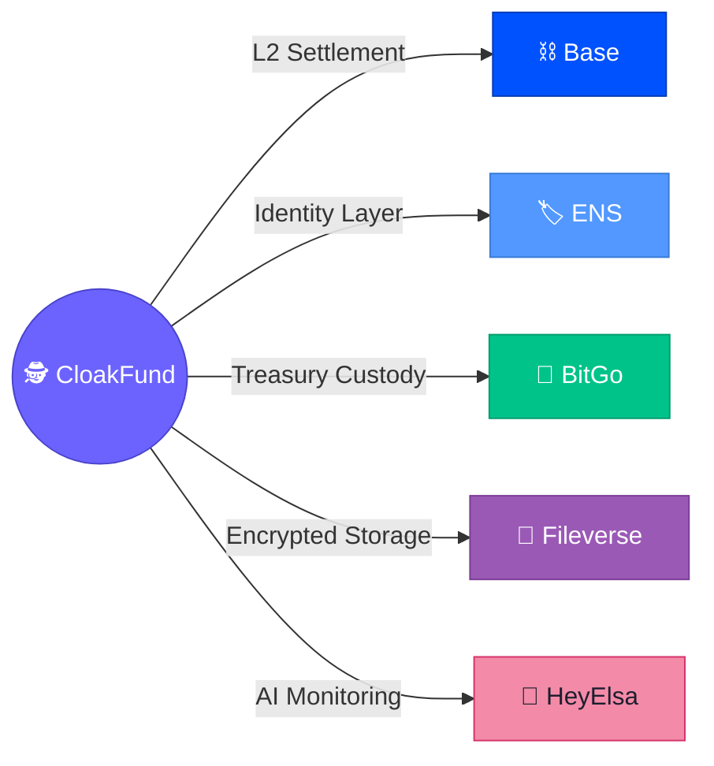

# 🏆 Sponsor Integrations — ETHMumbai 2026

> CloakFund integrates **five ETHMumbai sponsor technologies**, each playing a critical role in the architecture.

---

## Integration Map



---

## ⛓️ Base — Blockchain Infrastructure

| Aspect | Detail |
| ------ | ------ |
| **Role** | Primary L2 blockchain for all on-chain operations |
| **Why Base?** | Low gas fees make per-payment stealth address generation economically viable; fast block times enable real-time deposit detection |
| **Integration** | Smart contracts (`PaymentResolver`, `TreasuryForwarder`) deployed on Base; Watcher Service connects via Base WSS/RPC |

**Key Benefits:**
- 💰 Gas costs low enough for one-time address model
- ⚡ ~2 second block times for near-instant deposit confirmation
- 🔗 Full EVM compatibility — standard Solidity, standard tooling

---

## 🏷️ ENS — Identity Layer

| Aspect | Detail |
| ------ | ------ |
| **Role** | Human-readable identity for payment requests |
| **Why ENS?** | Users share `alice.eth` instead of raw addresses — better UX and privacy (ENS name never directly holds funds) |
| **Integration** | Frontend resolves ENS names; backend maps ENS to stealth meta-address for payment generation |

**Example Flow:**
```
Sender types: alice.eth
System resolves → stealth meta-address K
System generates → one-time payment address 0x91AF...
Sender pays → 0x91AF... (not alice.eth's wallet)
```

---

## 🏦 BitGo — MPC Treasury Infrastructure

| Aspect | Detail |
| ------ | ------ |
| **Role** | Multi-party computation custody for fund consolidation |
| **Why BitGo?** | MPC wallets eliminate single-point-of-failure for key management; institutional-grade custody without hardware wallets |
| **Integration** | Treasury Engine calls BitGo REST API to construct and sign consolidation transactions |

**Key Benefits:**
- 🔐 No single party ever has the complete private key
- ✅ Multi-signature approvals for all fund movements
- 📊 Full audit trail of every consolidation transaction

---

## 📄 Fileverse — Encrypted Document Storage

| Aspect | Detail |
| ------ | ------ |
| **Role** | Persistent encrypted storage for payment receipts and financial records |
| **Why Fileverse?** | Decentralized document storage with built-in encryption support; receipts are accessible by the user without trusting a centralized database |
| **Integration** | Encryption Service uploads ciphertext to Fileverse; frontend fetches and decrypts client-side |

**What's Stored:**
- 📄 Payment receipts (amount, timestamp, tx hash, memo)
- 📊 Financial records and summaries
- 🔐 All data encrypted with ChaCha20-Poly1305 before upload

---

## 🤖 HeyElsa — AI Monitoring Agent

| Aspect | Detail |
| ------ | ------ |
| **Role** | Automated monitoring and intelligence for payment activity |
| **Why HeyElsa?** | Adds intelligent alerting without manual monitoring; useful for treasuries managing high volumes |
| **Integration** | Watcher Service pushes events to HeyElsa; AI agent detects anomalies and generates summaries |

**Functions:**
- 🚨 Detect unusually large payments and alert the user
- 📝 Generate daily/weekly payment summaries
- 📈 Trend analysis on payment activity (without exposing individual data)

---

## Sponsor Track Alignment

| Sponsor | Prize Track | CloakFund's Qualification |
| ------- | ----------- | ------------------------- |
| **Base** | Build on Base | All smart contracts and settlement on Base L2 |
| **ENS** | ENS Integration | Core identity layer for privacy-preserving payments |
| **BitGo** | BitGo Custody | MPC treasury vault with programmatic consolidation |
| **Fileverse** | Fileverse Storage | Encrypted receipt storage with client-side decryption |
| **HeyElsa** | AI/Automation | AI-powered payment monitoring and anomaly detection |

---

→ See [ARCHITECTURE.md](./ARCHITECTURE.md) for where each integration fits in the system.
