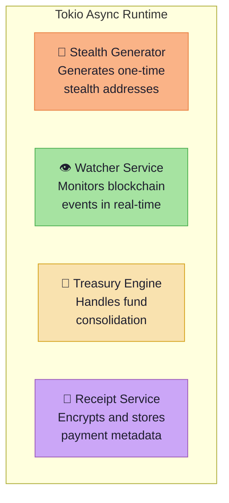

# ⚙️ System Design

> CloakFund is an **event-driven** system where each component reacts to upstream signals in a unidirectional pipeline.

---

## Payment Flow — 9-Step Lifecycle

Every transaction progresses through nine sequential, event-driven steps:

```mermaid
flowchart LR
    S1["1️⃣ Connect\nWallet"] --> S2["2️⃣ Enter\nENS Name"]
    S2 --> S3["3️⃣ Request\nPayment Link"]
    S3 --> S4["4️⃣ Generate\nStealth Address"]
    S4 --> S5["5️⃣ Sender\nTransfers Funds"]
    S5 --> S6["6️⃣ Watcher\nDetects Payment"]
    S6 --> S7["7️⃣ Dashboard\nUpdates Balance"]
    S7 --> S8["8️⃣ Receipt\nEncrypted & Stored"]
    S8 --> S9["9️⃣ Funds\nConsolidated"]

    style S1 fill:#89B4FA,stroke:#3B82F6,color:#1E1E2E
    style S2 fill:#89B4FA,stroke:#3B82F6,color:#1E1E2E
    style S3 fill:#6C63FF,stroke:#4A44CC,color:#fff
    style S4 fill:#FAB387,stroke:#E87D3E,color:#1E1E2E
    style S5 fill:#A6E3A1,stroke:#4CAF50,color:#1E1E2E
    style S6 fill:#F38BA8,stroke:#D6336C,color:#1E1E2E
    style S7 fill:#94E2D5,stroke:#2D9E8F,color:#1E1E2E
    style S8 fill:#CBA6F7,stroke:#9B59B6,color:#1E1E2E
    style S9 fill:#F9E2AF,stroke:#D4A017,color:#1E1E2E
```

| Step | Action | Component | Trigger |
| ---- | ------ | --------- | ------- |
| 1 | User connects wallet | Frontend | User action |
| 2 | User enters recipient ENS identity | Frontend | User input |
| 3 | Frontend requests payment link | Frontend → API | Button click |
| 4 | Backend generates stealth address via ECDH | Stealth Generator | API request |
| 5 | Sender transfers funds to stealth address | Sender wallet → Blockchain | External action |
| 6 | Blockchain watcher detects incoming payment | Watcher Service | On-chain event |
| 7 | Dashboard updates with aggregated balance | API → Frontend | SSE / WebSocket push |
| 8 | Receipt encrypted and stored in Fileverse | Encryption Service → Fileverse | Deposit confirmed |
| 9 | Funds optionally consolidated into treasury | Treasury Engine → BitGo MPC | Manual trigger or auto-sweep |

---

## Backend Services

The Rust backend runs four concurrent services on the Tokio async runtime:

| Service | Responsibility | Technology |
| ------- | -------------- | ---------- |
| **Stealth Generator** | Derives one-time addresses using ECDH | `k256`, HKDF, keccak |
| **Watcher Service** | Monitors blockchain for deposit events | `ethers-rs`, WebSocket/polling |
| **Treasury Engine** | Constructs and submits consolidation transactions | BitGo REST API |
| **Receipt Service** | Encrypts payment metadata before storage | ChaCha20-Poly1305 / AES-GCM |

---

## Event Flow

The system is designed around **events, not polling**:

| Event | Source | Consumer | Action |
| ----- | ------ | -------- | ------ |
| `PaymentRequested` | Frontend | API Server | Generate stealth address |
| `DepositDetected` | Blockchain | Watcher Service | Record deposit, notify frontend |
| `DepositConfirmed` | Watcher | Receipt Service | Encrypt and store receipt |
| `ConsolidationTriggered` | Dashboard / Auto-rule | Treasury Engine | Move funds to MPC vault |
| `LargePaymentAlert` | Watcher | HeyElsa AI | Generate alert / summary |

---

→ See [DATA_FLOW.md](./DATA_FLOW.md) for full sequence diagrams.
→ See [RUST_BACKEND_DESIGN.md](./RUST_BACKEND_DESIGN.md) for module-level detail.
