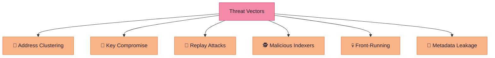

# ⚠️ Threat Model

> Identifying attack vectors and their mitigations to ensure CloakFund's privacy and security guarantees hold under adversarial conditions.

---

## Threat Categories



---

## Detailed Analysis

| # | Threat | Description | Severity | Mitigation | Status |
| - | ------ | ----------- | -------- | ---------- | ------ |
| 1 | **Address Clustering** | Observers attempt to link stealth addresses to a single recipient by analyzing on-chain patterns | 🔴 High | Stealth addresses are ECDH-derived with unique ephemeral keys — cryptographically unlinkable without the recipient's private key | ✅ Mitigated |
| 2 | **Key Compromise** | Attacker gains access to the backend server or stealth generator keys | 🔴 High | Backend never stores private keys; ephemeral keys are zeroized immediately; BitGo MPC prevents single-key compromise | ✅ Mitigated |
| 3 | **Replay Attacks** | Attacker replays a previous stealth address generation request to redirect funds | 🟡 Medium | Each paylink generates a fresh ephemeral key pair; nonces prevent request replay; paylink IDs are single-use | ✅ Mitigated |
| 4 | **Malicious Indexers** | A compromised blockchain indexer provides false deposit data to the watcher | 🟡 Medium | Watcher validates deposits against on-chain state; configurable confirmation depth; multiple RPC providers as fallback | ✅ Mitigated |
| 5 | **Front-Running** | Miners or MEV bots observe stealth address creation and attempt to intercept | 🟢 Low | Stealth addresses are generated off-chain; only the final transfer is on-chain; no value exposed during generation | ✅ Mitigated |
| 6 | **Metadata Leakage** | Receipt data or payment metadata leaks through the backend or storage layer | 🟡 Medium | All receipts encrypted before storage (ChaCha20/AES-GCM); backend never sees plaintext; Fileverse stores ciphertext only | ✅ Mitigated |

---

## Trust Assumptions

| Assumption | Risk If Violated |
| ---------- | ---------------- |
| User's wallet is secure | Attacker can derive stealth keys and access all funds |
| Base L2 is available and honest | Deposits may not be detected; use fallback RPC |
| BitGo infrastructure is operational | Consolidation delays; funds remain safe in stealth addresses |
| Fileverse stores data reliably | Receipts may be temporarily unavailable; re-upload on failure |

---

## Defense-in-Depth Strategy

```
Layer 1: Cryptographic   → ECDH stealth addresses, authenticated encryption
Layer 2: Architectural   → Key-less server, client-side decryption
Layer 3: Infrastructure  → BitGo MPC, multi-provider blockchain access
Layer 4: Operational     → Audit logging, health monitoring, graceful degradation
```

---

→ See [SECURITY.md](./SECURITY.md) for the full security invariant list.
→ See [CRYPTOGRAPHY.md](./CRYPTOGRAPHY.md) for the cryptographic foundations.
